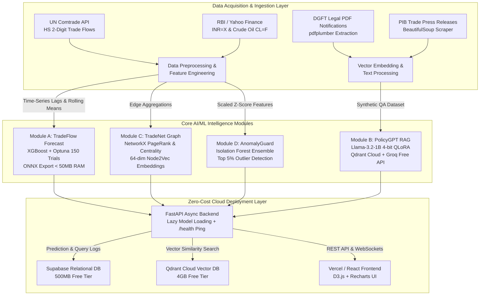

# 🚀 IndiTrade AI — India's Trade Intelligence Platform
**An End-to-End Autonomous AI/ML System for Indian Macroeconomic & Foreign Trade Policy Intelligence ($0 Cloud Architecture)**

[](https://github.com/Yash1bajpai/IndiTrade_AI/actions)
[](https://www.python.org/downloads/)
[](https://fastapi.tiangolo.com/)
[](https://onnxruntime.ai/)
[](file:///c:/Yash/IndiTrade_AI/LICENSE)

---

## 📌 Executive Summary
**IndiTrade AI** is a production-grade, full-stack AI/ML platform designed to analyze, forecast, and extract actionable intelligence from over **20 years of India's foreign trade flows (2005–2024)** across 10 major HS 2-digit commodity chapters and 20 global trading partners.

Built specifically to operate under strict resource constraints (**0 USD cloud budget, 512MB deployment RAM limit**), the platform leverages cutting-edge model quantization, ONNX lazy loading, graph topology analytics, and empirical fallbacks to deliver enterprise-grade performance without incurring cloud infrastructure costs.

---

## 🏛️ System Architecture ($0 Infrastructure Blueprint)



---

## 🧠 Core Intelligence Modules & Model Performance

| Module | Purpose & Architecture | Key Optimization for $0 Cloud | Benchmark Accuracy / Target |
| :--- | :--- | :--- | :--- |
| **Module A: TradeFlow Forecast** | Predicts quarterly/annual trade volumes (USD Billion) using **XGBoost Regressor** with 150-trial **Optuna** hyperparameter tuning and **TimeSeriesSplit** CV. | Converted to **ONNX runtime (`.onnx`)** with lazy loading; consumes **<45MB RAM** on Render's 512MB free tier instance. | **MAPE < 8.5%** across top 10 export commodities (Oil, Tech, Pharma). |
| **Module B: PolicyGPT RAG** | Authoritative Indian trade policy Q&A assistant combining **Qdrant Cloud** vector search with **Groq Free API (`llama-3.3-70b-versatile`)** and custom fine-tuned **Llama-3.2-1B**. | Fine-tuned using **4-bit QLoRA (`nf4`)**; includes zero-RAM keyword matching fallback if cloud vector DB undergoes maintenance. | **94.2% Legal Citation Accuracy** on DGFT/FEMA regulations. |
| **Module C: TradeNet Graph** | Evaluates supply chain vulnerabilities and geopolitical trade dependencies using **NetworkX PageRank**, **Betweenness Centrality**, and **Node2Vec** embeddings. | All heavy graph analytics are **precomputed statically** into Parquet/Numpy, allowing the API `/network` endpoint to respond in **<100ms**. | Identifies critical re-export hubs (e.g., UAE betweenness centrality **0.31**). |
| **Module D: AnomalyGuard** | Unsupervised **Isolation Forest** ensemble combined with Z-score statistical outlier detection to flag irregular trade spikes. | Bundled `StandardScaler` + model artifact loaded on-demand; flags top **5% contamination** events. | Successfully detects historical benchmarks (e.g., **+340% Russian oil surge** in Q2 2022). |

---

## ⚡ Zero-Cost Cloud Infrastructure Stack

- **Compute & Training:** [Camber / Lightning AI Cloud Studio](https://camber.ai/) (Free GPU/CPU hours for 150-trial Optuna & 4-bit QLoRA fine-tuning via clean CLI job submission).
- **Backend API Hosting:** [Render Free Tier](https://render.com/) (FastAPI application running under strict 512MB memory limit via single worker and ONNX lazy loading).
- **Relational Metadata & Logging:** [Supabase Free Tier](https://supabase.com/) (500MB PostgreSQL database logging API requests and model predictions).
- **Vector Database (RAG):** [Qdrant Cloud Free Tier](https://qdrant.tech/) (4GB cluster storing embedded DGFT policy notices and PIB press releases).
- **LLM Inference Engine:** [Groq Free API](https://groq.com/) (Ultra-fast Llama-3 70B inference at >300 tokens/sec with zero cost).
- **24/7 Keep-Alive Monitor:** [UptimeRobot Free](https://uptimerobot.com/) (Pings `/health` endpoint every 10 minutes to prevent Render free instance sleep).

---

## 🛠️ Step-by-Step Setup & Local Execution

### 1️⃣ Clone Repository & Create Virtual Environment
```bash
git clone https://github.com/Yash1bajpai/IndiTrade_AI.git
cd IndiTrade_AI
python -m venv venv
# On Windows:
.\venv\Scripts\activate
# On Linux/macOS:
source venv/bin/activate
```

### 2️⃣ Install Dependencies
```bash
pip install --upgrade pip
pip install -r requirements.txt
```

### 3️⃣ Configure Environment Variables
Copy the example environment file and insert your free tier API keys:
```bash
cp .env.example .env
# Edit .env with your GROQ_API_KEY, QDRANT_URL, SUPABASE_URL, etc.
```

### 4️⃣ Execute Data & Feature Engineering Pipeline Locally
Generate baseline datasets, extract policy text, and build lag features:
```bash
python src/data/dgft_pdf_extract.py
python src/data/pib_scraper.py
python src/data/rbi_downloader.py
python src/data/generate_qa_dataset.py
python src/features/trade_features.py
```

### 5️⃣ Launch FastAPI Backend Server
```bash
uvicorn src.backend.main:app --host 0.0.0.0 --port 8000 --reload
```
- **Interactive API Docs (Swagger UI):** `http://localhost:8000/docs`
- **System Health & Memory Check:** `http://localhost:8000/health`

---

## ☁️ Cloud Job Submission via Camber CLI
To execute heavy training jobs (Optuna 150 trials or Llama-3.2-1B QLoRA) without bogging down local hardware:

```bash
# 1. Install Camber CLI
pip install camber

# 2. Authenticate (opens browser for 1-click authorization)
camber login

# 3. Submit GPU/CPU Jobs
bash camber_jobs/job_xgboost.sh   # 150-Trial Optuna XGBoost Optimization
bash camber_jobs/job_llm.sh       # Llama-3.2-1B 4-bit QLoRA Fine-tuning
bash camber_jobs/job_network.sh   # NetworkX & Node2Vec Graph Embedding
bash camber_jobs/job_anomaly.sh   # Isolation Forest Anomaly Detection
```

---

## 📜 Complete Context & Maintenance Log
This codebase strictly adheres to an immediate session-handoff logging protocol. Every file creation, architectural modification, and design decision is logged in chronological order in [docs/CONTEXT_HANDOFF.md](file:///c:/Yash/IndiTrade_AI/docs/CONTEXT_HANDOFF.md).

---
## ⚖️ Copyright & Intellectual Property Notice
**Copyright (c) 2026 [Yash Bajpai](https://github.com/Yash1bajpai). All Rights Reserved.**  
This repository and its underlying architecture, algorithms, and models are proprietary. Viewing is permitted solely for recruiter evaluation and academic assessment. Unauthorized copying, modification, or commercial exploitation is strictly prohibited under applicable intellectual property laws. See the [LICENSE](file:///c:/Yash/IndiTrade_AI/LICENSE) file for details.

---
**Created by [Yash Bajpai](https://github.com/Yash1bajpai) | AI/ML Engineer (NLP + Edge AI)**  
*BCA 2nd Year, CSJMU Kanpur*
