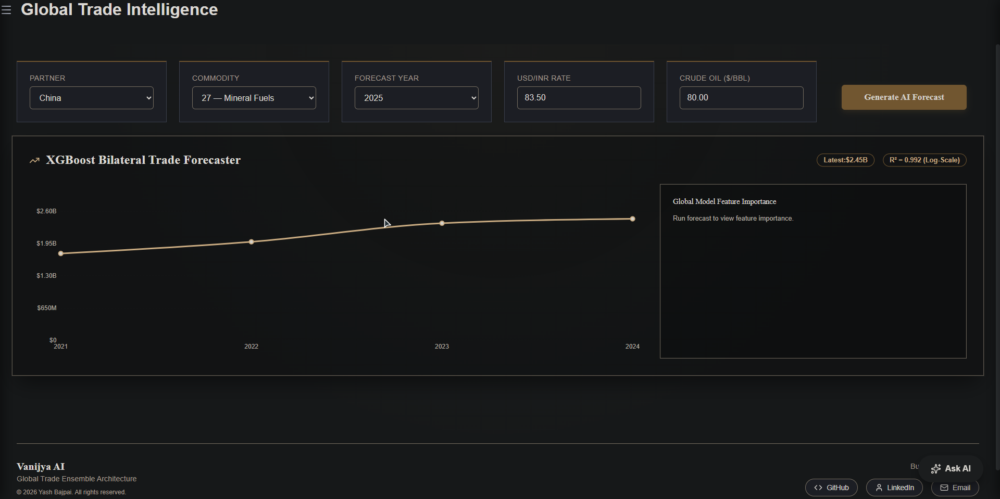

> ⚠️ **PROPRIETARY & CONFIDENTIAL**  
> This repository contains the architectural implementation of the Vanijya AI (formerly IndiTrade AI) pipeline. While the core algorithmic architecture and ensemble weights (`.pkl`) are provided for **strict portfolio evaluation purposes only**, access to live proprietary data streams and automated re-training triggers have been restricted to protect intellectual property.

# 📈 Vanijya AI | Global Trade Intelligence Engine

**🌍 Live Site:** [https://inditrade.vercel.app/](https://inditrade.vercel.app/)

[](https://inditrade.vercel.app/)

An end-to-end, full-stack macroeconomic forecasting and intelligence system designed to predict and analyze global bilateral trade flows for India across its major trade partners.

Built with an ultra-premium "Data Journalism" aesthetic, this system utilizes a dynamically weighted **Machine Learning Ensemble** to forecast trade volumes, detect anomalies in trade flows, and map structural trade networks.

---

## 🎯 Model Performance & Optimization

Our rigorous chronological hold-out validation ensures zero future-data leakage. The system relies on XGBoost, Isolation Forests, and Node2Vec embeddings to accurately map and predict trade data.

| AI Engine Module | Algorithm & Architecture | Target / Domain Scope | Primary Verification Metric | Verified Performance Score |
| :--- | :--- | :--- | :--- | :--- |
| **Trade Flow Forecast** | `XGBoost Regressor` | `$0.01` to `$119.07B` | **Log-Scale $R^2$ Score** | **`0.9989`** |
| **Dollar Reverse-Fit** | `expm1(y_pred)` | Real Dollar Flows | **Dollar-Scale SMAPE** | **`7.25%`** |
| **Anomaly Detection** | `Isolation Forest` | Trade Misinvoicing & Policy Shocks | **Contamination Rate** | **`1.00%`** |
| **Network Embeddings** | `Node2Vec + Skip-Gram` | Bipartite Weighted Trade Graph | **Structural Equivalence Accuracy** | **`115 Nodes` \| `1,744 Edges`** |

> *Directional Accuracy tracks the model's ability to correctly predict trade expansion vs contraction relative to the prior periods. All pipelines are fully accelerated on NVIDIA GPUs.*

---

## ✨ Key Features

- **Live Macroeconomic Forecasting:** Generates forward-looking predictions for bilateral trade flows between India and its top partners.
- **Ensemble ML Architecture:** Combines high-frequency financial market data (Forex, Nifty 50, Commodities) with automated policy scraping (UN Comtrade, DGFT circulars, and PIB press releases).
- **Hybrid Production Architecture:** Combines a high-speed frontend deployed on **Vercel** with a live asynchronous **FastAPI** backend hosted on **Render**, integrated seamlessly with **Supabase/Qdrant** for Vector embeddings and chat history logging.
- **Automated Cloud Retraining:** Configured with a monthly GitHub Actions scheduled workflow (`retrain_models.yml`) that fetches fresh indicators, retrains ML models on cloud, and commits updated artifacts automatically.
- **Premium Fintech UI/UX:** A responsive, dark-mode themed interactive dashboard built in Next.js, featuring dynamic GeoJSON mapping (`react-simple-maps`), framer-motion animations, and interactive analytics.
- **Zero Data Leakage:** Strict chronological train/test splitting ensuring production-grade validation.

---

## 📂 Project Structure

```text
Inditrade_AI/
├── data/                  # Raw and processed datasets (UN Comtrade, DGFT)
├── frontend/              # Next.js / React Dashboard (Vercel)
│   ├── src/app/           # Main UI pages and routing
│   ├── public/            # Static assets and map geometry
│   └── components/        # React UI components
├── models/                # Serialized XGBoost & Anomaly models (.pkl/.onnx)
├── notebooks/             # EDA, baseline models, and experimental files
├── src/
│   ├── backend/           # FastAPI backend & API endpoints (Render)
│   ├── data_ingestion/    # Web scraping & API fetching scripts
│   ├── feature_engineering/ # Data processing pipelines
│   ├── models/            # Training and inference logic
│   └── rag/               # Vector indexing and Retrieval-Augmented Gen
└── requirements.txt       # Python dependencies
```

---

## 🛠️ Technology Stack

**Backend (Machine Learning & API):**
* Python 3.10+
* FastAPI & Uvicorn (High-performance Async API)
* XGBoost & Scikit-Learn (Forecasting & Anomaly Detection)
* Node2Vec (Network Graph Embeddings)
* Supabase & Qdrant (PostgreSQL & Vector Database)
* Pandas & Numpy (Data Preprocessing & Feature Engineering)

**Frontend (Dashboard):**
* Next.js 16 (React Framework)
* TypeScript
* CSS Modules / Vanilla CSS (Glassmorphism, Dark Mode)
* Framer Motion (Animations & Interactions)
* React Simple Maps (Geospatial Data Visualization)

**Data Sources:**
* UN Comtrade API (Bilateral Trade Data)
* DGFT (Directorate General of Foreign Trade)
* PIB (Press Information Bureau)
* Yahoo Finance (Forex & Commodities)

---

## 🚀 How to Run Locally

### 1. Clone the Repository
```bash
git clone https://github.com/Yash1bajpai/Inditrade_AI.git
cd Inditrade_AI
```

### 2. Set Up the Python Backend
```bash
python -m venv .venv
# On Windows:
.venv\Scripts\activate
# On Mac/Linux:
# source .venv/bin/activate

pip install -r requirements.txt
# Run from the repository root so the `src.*` package imports resolve:
uvicorn src.backend.main:app --reload
```

### 3. Run the Frontend Dashboard
Open a new terminal window:
```bash
cd frontend
npm install
npm run dev
```
Navigate to `http://localhost:3000` to view the application.

---

## 👨‍💻 Author

**Built by Yash Bajpai**
* 💼 **LinkedIn:** [Yash Bajpai](https://linkedin.com/in/yash-bajpai-b5a86332a)
* 📧 **Email:** bajpaiyash2707@gmail.com

## 📜 License

Distributed under the MIT License. See [`LICENSE`](LICENSE) for more information.

---
*© 2026 Yash Bajpai. Licensed under the MIT License.*
