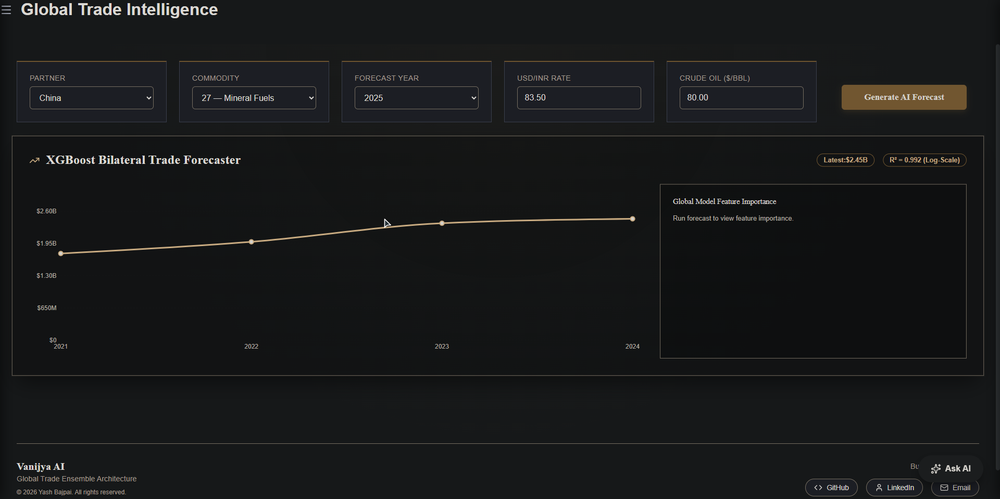

> ⚠️ **PROPRIETARY & CONFIDENTIAL**  
> This repository contains the architectural implementation of the Inditrade AI pipeline. While the core algorithmic architecture and ensemble weights (`.pkl`) are provided for **strict portfolio evaluation purposes only**, access to live proprietary data streams and automated re-training triggers have been restricted to protect intellectual property.

# 📈 Inditrade AI | Global Trade Intelligence Engine

**🌍 Live Site:** [https://inditrade.vercel.app/](https://inditrade.vercel.app/)

[](https://inditrade.vercel.app/)

An end-to-end, full-stack macroeconomic forecasting and intelligence system designed to predict and analyze global bilateral trade flows for India across its major trade partners.

Built with an ultra-premium "Data Journalism" aesthetic, this system utilizes a dynamically weighted **Machine Learning Ensemble** to forecast trade volumes, detect anomalies in trade flows, and map structural trade networks.

---

## 🎯 Model Performance & Optimization

The historical log-R² of **0.9579** and provisional CPU rerun score of **0.9576** are not valid prospective forecast scores. The old feature list included current-target YoY growth, same-year quantities/weights, and annual macro summaries that were not known before the forecast year.

A corrected CPU evaluation uses explicit past-only calendar-year lags, previous-year macro values, import/export encoding, and year-blocked cross-validation. Its 2022–2025 holdout is a **rolling one-year evaluation** using observed prior years, not a frozen-origin multi-year forecast. Compare it with a previous-year naive baseline before considering deployment.

**Data quality blocks promotion:** the source release mixes all-second-partner totals (`partner2Code=0`) with 1,072 nonzero second-partner slices in 2023–2025. For example, the 2023 USA fuel import cell is $3,573.855 with `partner2Code=36`, not the comparable bilateral total. Clean evaluation excludes these slices, leaving 34,207 rows and explicit missing years. France/Switzerland 2025 M/X slices also remain missing pending a valid Comtrade key. No values are imputed as factual trade totals.

The existing production artifacts are retained while this correction is evaluated. Historical scores must not be presented as leakage-free accuracy. Isolation Forest flag counts reflect the configured 1% contamination, not validated detection accuracy; Node2Vec coverage is not forecast accuracy.

---

## ✨ Key Features

- **Live Macroeconomic Forecasting:** Generates forward-looking predictions for bilateral trade flows between India and its top partners.
- **Ensemble ML Architecture:** Combines high-frequency financial market data (Forex, Nifty 50, Commodities) with automated policy scraping (UN Comtrade, DGFT circulars, and PIB press releases).
- **Hybrid Production Architecture:** Combines a high-speed frontend deployed on **Vercel** with a live asynchronous **FastAPI** backend hosted on **Render**, integrated seamlessly with **Supabase/Qdrant** for Vector embeddings and chat history logging.
- **Automated Cloud Retraining:** Configured with a monthly GitHub Actions scheduled workflow (`retrain_models.yml`) that fetches fresh indicators, retrains ML models on cloud, and commits updated artifacts automatically.
- **Premium Fintech UI/UX:** A responsive, dark-mode themed interactive dashboard built in Next.js, featuring dynamic GeoJSON mapping (`react-simple-maps`), framer-motion animations, and interactive analytics.
- **Forecast validation:** Past-only predictor contract and year-blocked CV; promotion remains blocked on source-grain repair and honest evaluation.
- **Vanijya Chat (Hybrid RAG):** An embedded assistant answering natural-language questions over trade documents — dense + BM25 retrieval fused with Reciprocal Rank Fusion over 5,062 indexed chunks (0.917 hit@5, 0.881 MRR@10 on 300 judged queries). `Vanijya` is the chat layer's name; the platform is Inditrade AI.

---

## 📂 Project Structure

```text
Inditrade_AI/
├── data/                  # Raw and processed datasets (UN Comtrade, DGFT)
├── frontend/              # Next.js / React Dashboard (Vercel)
│   ├── src/app/           # Main UI pages and routing
│   ├── public/            # Static assets and map geometry
│   └── components/        # React UI components
├── models/                # Serialized XGBoost & Anomaly models (.pkl/.onnx)
├── notebooks/             # EDA, baseline models, and experimental files
├── src/
│   ├── backend/           # FastAPI backend & API endpoints (Render)
│   ├── data_ingestion/    # Web scraping & API fetching scripts
│   ├── feature_engineering/ # Data processing pipelines
│   ├── models/            # Training and inference logic
│   └── rag/               # Vector indexing and Retrieval-Augmented Gen
└── requirements.txt       # Python dependencies
```

---

## 🛠️ Technology Stack

**Backend (Machine Learning & API):**
* Python 3.10+
* FastAPI & Uvicorn (High-performance Async API)
* XGBoost & Scikit-Learn (Forecasting & Anomaly Detection)
* Node2Vec (Network Graph Embeddings)
* Supabase & Qdrant (PostgreSQL & Vector Database)
* Pandas & Numpy (Data Preprocessing & Feature Engineering)

**Frontend (Dashboard):**
* Next.js 16 (React Framework)
* TypeScript
* CSS Modules / Vanilla CSS (Glassmorphism, Dark Mode)
* Framer Motion (Animations & Interactions)
* React Simple Maps (Geospatial Data Visualization)

**Data Sources:**
* UN Comtrade API (Bilateral Trade Data)
* DGFT (Directorate General of Foreign Trade)
* PIB (Press Information Bureau)
* Yahoo Finance (Forex & Commodities)

---

## 🚀 How to Run Locally

### 1. Clone the Repository
```bash
git clone https://github.com/Yash1bajpai/Inditrade_AI.git
cd Inditrade_AI
```

### 2. Set Up the Python Backend
```bash
python -m venv .venv
# On Windows:
.venv\Scripts\activate
# On Mac/Linux:
# source .venv/bin/activate

pip install -r requirements.txt
# Run from the repository root so the `src.*` package imports resolve:
uvicorn src.backend.main:app --reload
```

### 3. Run the Frontend Dashboard
Open a new terminal window:
```bash
cd frontend
npm install
npm run dev
```
Navigate to `http://localhost:3000` to view the application.

---

## 👨‍💻 Author

**Built by Yash Bajpai**
* 💼 **LinkedIn:** [Yash Bajpai](https://linkedin.com/in/yash-bajpai-b5a86332a)
* 📧 **Email:** bajpaiyash2707@gmail.com

## 📜 License

Distributed under the MIT License. See [`LICENSE`](LICENSE) for more information.

---
*© 2026 Yash Bajpai. Licensed under the MIT License.*
